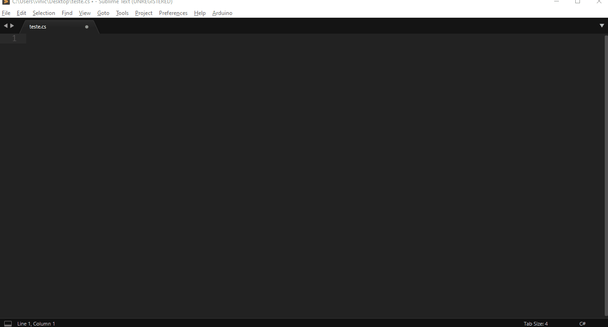

# sBotics-sublime-snippets
Conjunto de snippets para sublime para programar em csharp o sBotics :)
Contém arquivo de build para quem utiliza do compilador [R-EducCompiler](https://github.com/Eduardo-Barreto/R-EducCompiler "Heading link"), que pode ser modificado para o csharp!

# Adicionar snippets ao sublime text 3:
1. Abra a pasta de pacotes pelo sublime(`Preferences ->  Browse Packages...`);
2. Entre na pasta chamada `User`;
3. Adicione a pasta `sBoticsCsharpSnippets` do projeto nesse diretório.

Pronto! Agora todos os aquivos com extensão `.cs` terão esses snippets de código.

# Utilizar do builder para o R-EducCompiler:
*necessário concluir o processo anterior*
1. Na barra de ferramentas superior do sublime abra a opção `Tools`;
2. Vá ao segmento `Build System`;
3. Selecione o método de build `sBoticsBarretoCompiler`.

Após completar esses passos, sempre que estiver em um aquivo da pasta `src` do [R-EducCompiler](https://github.com/Eduardo-Barreto/R-EducCompiler "Heading link") e pressionar **Control + B** o sublime irá iniciar o script de compilação automaticamente.

# Adendos:

É necessário a instalação do python3 para utilizar do Csharp compiler da pasta `Csharp-compiler-by-eduardo-barreto`, ele segue os mesmo passos do projeto [R-EducCompiler](https://github.com/Eduardo-Barreto/R-EducCompiler "Heading link") então para mais informações consulte o seu uso.
O arquivo `csharp_compiler.py` é uma melhoria do compilador, e é recomendado o uso caso for utilizar o método de compilação por atalho no sublime.

Caso duvidas, envie no #geral do discord sBotics( http://bit.ly/sboticsdiscord ).
